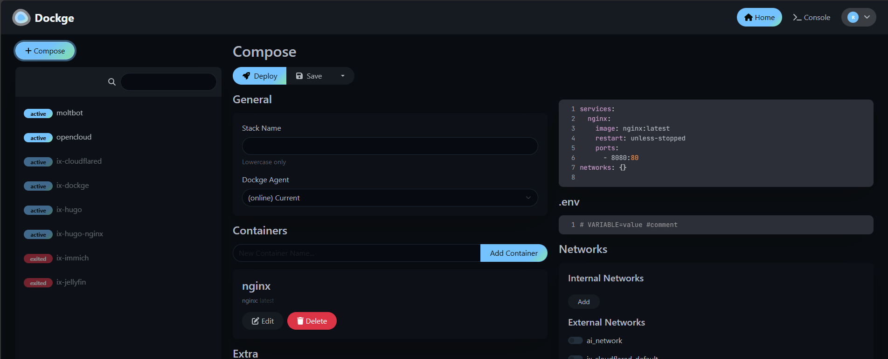

# Deploy Moltbot + Ollama on TrueNAS SCALE

This guide covers deploying Moltbot + Ollama on a **TrueNAS SCALE** server. You can use **Dockge** (recommended) or the **TrueCharts Docker Compose** app to run the same stack.

## Deployment options on TrueNAS SCALE

- **Dockge** – Web UI for Docker Compose; install via **Apps → Discover Apps** (search “dockge”). See [Dockge](https://dockge.kuma.pet/) and [TrueNAS-Compose](https://www.truenas-compose.com/) for full setup (ZFS datasets, Dockge install, networking).  
  > **Note:** [TrueNAS-Compose](https://www.truenas-compose.com/) had a major structure change on **May 1, 2025**; installations from before that date may need a fresh start.
- **TrueCharts Docker Compose** – Upload your own `docker-compose.yml` via the TrueNAS interface (TrueCharts integrates Docker Compose with TrueNAS SCALE).

## Prerequisites

- TrueNAS SCALE with Docker/Apps enabled
- Dockge or TrueCharts Docker Compose app installed
- A ZFS pool for storing Moltbot and Ollama data

## Step 1: Create ZFS datasets

Create dedicated datasets for persistent data. In TrueNAS Web UI:

1. Go to **Datasets** → Select your pool → **Add Dataset**
2. Create the following datasets:

   | Dataset Name | Purpose |
   |--------------|---------|
   | `moltbot` | Parent dataset for all Moltbot data |
   | `moltbot/config` | Moltbot configuration (`moltbot.json`, agent state) |
   | `moltbot/workspace` | Agent workspace files |
   | `moltbot/ollama` | Ollama models (can be large, 5-50+ GB) |
   | `moltbot/stacks` | Dockge stacks (if not already set up) |

   Example paths (assuming pool named `tank`):
   ```
   /mnt/tank/moltbot
   /mnt/tank/moltbot/config
   /mnt/tank/moltbot/workspace
   /mnt/tank/moltbot/ollama
   ```

3. **Set permissions** for the config and workspace datasets (Moltbot runs as UID 1000):
   
   In TrueNAS Shell or SSH:
   ```bash
   # Set ownership to UID 1000 (node user in container)
   chown -R 1000:1000 /mnt/tank/moltbot/config
   chown -R 1000:1000 /mnt/tank/moltbot/workspace
   
   # Ollama runs as root, so leave default permissions
   # chown -R root:root /mnt/tank/moltbot/ollama  # (default)
   ```

## Step 2: Create the stack in Dockge

You define the stack in Dockge’s UI: use the **compose YAML editor** for the compose content and the **.env** section for environment variables. You do not copy compose or .env from your machine.



*Dockge UI: stack list (left), compose YAML editor and .env section (centre). Use the YAML editor for the compose content and the .env section for variables.*

1. Open Dockge web UI (e.g. `http://truenas:5001` or your Dockge port).
2. Click **+ Compose** and set the stack name to `moltbot` (lowercase).
3. In the **compose YAML editor**, delete the default content and paste the full compose block below (Option A). Replace `/mnt/tank/moltbot` with your dataset path.
4. In the **.env** section, add your variables (see table below). Generate a token with `openssl rand -hex 32`.

**Build context:** The gateway service builds from a Dockerfile. Dockge runs from a stack directory; for the build to work, that directory must contain the Dockerfile. After creating the stack, copy the **Dockerfile** (and any files it needs) into the stack folder on TrueNAS (e.g. via SSH or by cloning the repo there).


**.env variables** (set these in Dockge’s .env section):

| Variable | TrueNAS value (example) |
|----------|-------------------------|
| `CLAWDBOT_GATEWAY_TOKEN` | `<your-generated-token>` (required) |
| `CLAWDBOT_CONFIG_DIR` | `/mnt/tank/moltbot/config` |
| `CLAWDBOT_WORKSPACE_DIR` | `/mnt/tank/moltbot/workspace` |

**Option A – Full compose** (paste into the compose YAML editor; replace `/mnt/tank/moltbot` with your path):

```yaml
# Moltbot + Ollama for TrueNAS SCALE (full override)
# Replace /mnt/tank/moltbot with your dataset path

services:
  ollama:
    image: ollama/ollama:latest
    container_name: moltbot-ollama
    ports:
      - "11434:11434"
    volumes:
      - /mnt/tank/moltbot/ollama:/root/.ollama
    restart: unless-stopped

  moltbot-gateway:
    image: ${CLAWDBOT_IMAGE:-moltbot:local}
    build:
      context: .
      dockerfile: Dockerfile
    container_name: moltbot-gateway
    environment:
      HOME: /home/node
      TERM: xterm-256color
      CLAWDBOT_GATEWAY_TOKEN: ${CLAWDBOT_GATEWAY_TOKEN}
      CLAWDBOT_GATEWAY_PORT: 18789
      CLAWDBOT_BRIDGE_PORT: 18790
      OLLAMA_API_KEY: ${OLLAMA_API_KEY:-ollama-local}
      OLLAMA_BASE_URL: ${OLLAMA_BASE_URL:-http://ollama:11434}
      BRAVE_API_KEY: ${BRAVE_API_KEY:-}
      TELEGRAM_BOT_TOKEN: ${TELEGRAM_BOT_TOKEN:-}
    volumes:
      - /mnt/tank/moltbot/config:/home/node/.moltbot
      - /mnt/tank/moltbot/workspace:/home/node/clawd
    ports:
      - "18789:18789"
      - "18790:18790"
    depends_on:
      - ollama
    init: true
    restart: unless-stopped
    command:
      [
        "node",
        "dist/index.js",
        "gateway",
        "--bind",
        "lan",
        "--port",
        "18789",
        "--allow-unconfigured"
      ]
```

## Step 3: Copy the config file

Before starting, copy the Ollama config so the agent uses Ollama (not Anthropic). If you put the repo (or at least `config-ollama-default.example.json`) in the stack folder for the build, use that path; otherwise copy the example file from the repo into the config dataset.

```bash
# SSH into TrueNAS
ssh root@truenas

# Copy and edit the config (adjust first path if your stack folder is elsewhere)
cp /mnt/tank/moltbot/stacks/moltbot/config-ollama-default.example.json \
   /mnt/tank/moltbot/config/moltbot.json

# Edit if using a different model (e.g., qwen3:1.7b for faster CPU responses)
nano /mnt/tank/moltbot/config/moltbot.json
```

Ensure permissions:
```bash
chown 1000:1000 /mnt/tank/moltbot/config/moltbot.json
```

## Step 4: Deploy the stack

1. In Dockge, click **Deploy** (or **Start**)
2. Wait for the images to build/pull (first run takes several minutes)
3. Check logs for errors: click on `moltbot-gateway` → **Logs**

## Step 5: Pull an Ollama model

```bash
# From TrueNAS shell or Dockge terminal
docker exec moltbot-ollama ollama pull qwen3:1.7b
```

Or use the larger `qwen3` if you have enough RAM and can tolerate slower responses.

## Step 6: Access the dashboard

1. Open `http://<truenas-ip>:18789/?token=YOUR_TOKEN`
2. Approve device pairing (first time):
   ```bash
   docker exec moltbot-gateway node dist/index.js devices list
   docker exec moltbot-gateway node dist/index.js devices approve <REQUEST_ID>
   ```
3. Refresh the browser and start chatting

## TrueNAS-specific tips

- **Backup**: Your datasets (`config`, `workspace`, `ollama`) are on ZFS—set up snapshots/replication for backup.
- **Remote Access**: Use Tailscale or Cloudflare Tunnel instead of exposing port 18789 directly to the internet.
- **Resource Limits**: In Dockge/docker-compose, you can add CPU/memory limits:
  ```yaml
  moltbot-gateway:
    deploy:
      resources:
        limits:
          cpus: '2'
          memory: 4G
  ollama:
    deploy:
      resources:
        limits:
          cpus: '4'
          memory: 8G
  ```
- **GPU Passthrough** (if TrueNAS host has NVIDIA GPU): Add to the `ollama` service:
  ```yaml
  ollama:
    runtime: nvidia
    environment:
      - NVIDIA_VISIBLE_DEVICES=all
  ```

## Quick reference: paths and ports

| Purpose | Dataset path | Container mount |
|---------|--------------|------------------|
| Moltbot config | `/mnt/tank/moltbot/config` | `/home/node/.moltbot` |
| Agent workspace | `/mnt/tank/moltbot/workspace` | `/home/node/clawd` |
| Ollama models | `/mnt/tank/moltbot/ollama` | `/root/.ollama` |

| Service | Port | Purpose |
|---------|------|---------|
| Gateway (dashboard) | 18789 | Web UI and API |
| Bridge | 18790 | Internal bridge |
| Ollama API | 11434 | Ollama API |

## References

- [README.md](README.md) – Local Docker setup
- [Dockge](https://dockge.kuma.pet/)
- [TrueNAS-Compose](https://www.truenas-compose.com/) – Docker stacks and Dockge setup for TrueNAS SCALE
- [Moltbot Docker install](https://docs.molt.bot/install/docker)
- [Moltbot Ollama provider](https://docs.molt.bot/providers/ollama)
